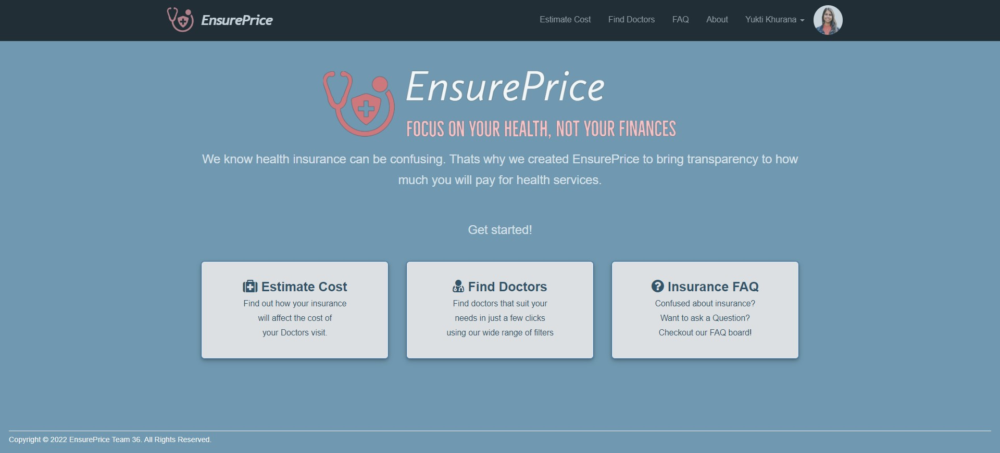

# ESAAS Project: Team 36

## EnsurePrice: Focus on your health, not your finances



## Team Members

**yk2950**: Yukti Khurana <br>
**cc4799**: Chiao Fen Chan <br>
**ml4272**: Muhan Liang <br>
**ia2422**: Isabelle Arevalo <br>

## Heroku Link
https://ensure-price.herokuapp.com/

## About

- Different healthcare insurance companies have different websites and many different policies under each one of their umbrellas. It is very `hard for an individual to decipher what each policy means`, let alone to know transparently how much their potential upcoming doctor’s visit would cost.
- This leaves a hole in the market and gives us an opportunity to help healthcare insurance policy holders have peace of mind before going into their doctor’s appointment - knowing how much they will end up paying.
- Our SAAS Platform solved this problem by providing our users unbiased and `transparent cost information` about their upcoming consultation so that they don't have to spend hours on phone or internet to understand their health insurance and benefits. 
- Further, it is hard to find solid reviews of various doctors online and users usually need to do a lot of research to find the doctors that accept their current insurance and suit their needs. To provide a single-click solution to this, our application not only `lets users find doctors based on various filters` but also `leave anonymous reviews for them`! These reviews can be edited or deleted as per user convenience. Therefore, our app aims to provide more transparency to the healthcare system in US.
- Insurance can be very confusing especially for students, therefore we have created an `EnsureAsk Forum`/`Insurance FAQ` where people can post their questions about Health insurance or various plans and get answers from other users and therfore build a `close-knit community to decode health insurance complexities together`. You can also `upvote your favourite answers` to show support!
- Currently our application targets users in `New York, US`. We are aiming to expand our database to other parts of US in the future.
- Our product is currently providing top plan and insurance policies from companies: `Aetna`, `Oscar`, `UnitedHealthCare`, `Cigna` and `Empire`. We aim to add more companies and expand our database to include more plans in the future.

## Application Flow: How To Use Our App
- Login to our ESaaS application using your email and password. If you don't have an account, you can create one!
- On Home Page, click on the `Estimate Code` button to find out the cost of your doctor's visit by answering some easy questions.
- You can click on the `Find Doctors` button to look for doctors based on your needs.
- Our app allows you to filter the doctors based on insurance plan, speciality and designation.
- Confused about Insurance? Participate in our `EnsureAsk` Community by clicking `Insurance FAQ` button.
- Our platform provides users an easy way to leave `anonymous reviews for doctors`! You can also read reviews for each doctor to make an informed decision.
- You can also view your previously given reviews, `edit them as well as delete` them by going to their profile page.
- Further, users can ask and answer questions related to` Health insurance`. You can also `upvote the best answers` to help your fellow members.

**_Disclaimer_**: Since the medical cost depends on a variety of factors which can differ on the case-to-case basis and the kind of treatment, our app in no way provides the exact cost of visit. Instead, our aim is to provide users with how much benefit they might receive with their current insurance plan, based on the visit. Therefore, we endeavour to demystify their health insurance.

## Features Implemented:
- `Signup` to our platform using your name, email and a password.
- `Login` to the application using your email and password.
- View your `Profile`.
- `Edit your Profile` to change your name, email, and profile photo.
- `Estimate doctor visits costs` by selecting your insurance, type of visit and doctor.
- `Find various doctors` using filters like insurance provider, specialty and designation.
- `View more information about each doctor like their gender, national provider identifier, location/address, phone number and more.
- `Leave reviews about a doctor` so that users can take an informed decision. We value your privacy, so the reviews would be completely anonymous.
- If something changes along the way, you can always `view` your previously given reviews on your profile, `edit` them and even `delete` them!
- To help educate people about health insurance, our platform provides an `Insurance FAQ` where people can `post questions, answers and upvote` their favourite ones.
- The about page in our app gives `detailed information on how to utilize it` along with some great tips to help you understand your insurance better. We are working to regularly update it to add more such information. `

**_Disclaimer_**: If the page that shows all the doctors take a few seconds to load, it is completely normal since we are using a large database with more than 5500 doctors. 

## Implementation

To achieve this objective, we have created four tables - `Health Insurance Plans`, `Doctors`, `Users`, `Doctor Reviews`.

#### Health Insurance Plans table

It contains details of various insurance plans given by different companies and the cost benefits they provide for different types of visits like Office visit, Critical Care, Specialist Treatment and more. Even though such details are provided on the insurance cards by most companies, people rarely know what they exactly mean and how it affects their final price.
Currently, we have collected and used a small part of the data available about various insurance policies from: https://nystateofhealth.ny.gov/

#### Doctors table

It contains details of doctors and which insurance providers are accepted by them so that the user can easily choose from the list of doctors that appears after they provide us their insurance provider.
We have used the following database for doctors: https://health.data.ny.gov/Health/Individual-Provider-Network-Data-2019-Quarter-4/jizq-disf

#### Users table
It stores users' profile  and login information.

#### Doctor Reviews table
It stores all the doctor reviews given by different users.

#### Questions table
It stores all the Questions asked by users.

#### Answers table
It stores all the answers given by users to various questions using question id and user id.

#### Votes table
It stores information about the number of votes each answer got so the users can take an informed decision.

**Note**: The csv files containing above tables to seed data can be found at `lib/seeds/doctors.csv` and `lib/seeds/health_insurance.csv`

#### User Stories

The user stories of our SAAS application can be found at `features` directory in `features` for the most basic features in our product. <br>
Following are our feature files:

- create_account.feature
- doctors_review.feature
- doctors.feature
- edit_account.feature
- estimate_visit_cost.feature
- login.feature
- navigation.feature
- no_login.feature
- faq.feature
- filter_user_answers.feature

The current cucumber test coverage is 100%.

#### Testing

We have thouroughly tested our application with a coverage of 100%. Our Rspec tests can be found at `spec` directory. Further, we have used FactoryBot to create test fixtures for our software testing. <br>

- doctor_reviews_controller_spec.rb
- doctors_controller_spec.rb
- ensureprices_controller_spec.rb
- sessions_controller_spec.rb
- static_pages_controller_spec.rb
- users_controller_spec.rb
- answers_controller_spec.rb
- questions_controller_spec.rb
- rating_helper_spec.rb
- doctors_spec.rb
- insurance_plans_spec.rb
- user_spec.rb
- price_spec.rb
- user_spec.rb
- visit_spec.rb

The rspec test coverage is 100%.


## Deployment

Following is the Heroku Deployment Link for our product. <br>
https://ensure-price.herokuapp.com/

### Ruby Version Bundler Version & Machine OS

ruby 2.6.6p146 (2020-03-31 revision 67876) [x86_64-darwin21] <br>
MacOS <br>
to correctly install the right bundler version: <br>

```
gem uninstall bundler
```

```
gem install bundler --version '1.9'
```

## Grading For Project Launch

### Branch for Grading:

master

### TA access: 
Repository is public now.
We have invited the ESAAS Course TAs to join organization's repo, and each TA should have received an email from GitHub regarding this. <br>
The invitation link is valid for 7 days, if the link is expired, please reach out to our team to grant access. <br>

### Steps to Run the App

1. bundle install --without production
2. bundle exec rake db:migrate
3. bundle exec rake db:setup
4. bundle exec rake db:test:prepare
5. bundle exec rails server

### Steps to Run Tests

1. bundle exec rake cucumber
2. bundle exec rake spec

## Other Details

### Creating Migration for Insurance Plans Table

```
rails generate migration CreateInsurancePlans company_name:string insurance_plan_name:text individual_annual_deductible:text ov:text er:text uc:text spc:text ho:text
```

### Creating Migration for Doctors Table

```
rails generate migration CreateDoctors last_name:string first_name:string national_provider_identifier:text medicaid_provider:text site_name:string room_or_suite:string street_address:string town_city:string state:string county:string zip_code:string phone_number:text provider_type:string gender:string commercial_provider_indicator:string plan_name:text insurance_plan:string specialty:string designation:string doctor_name:string location:text
```

### db/seeds

If seed doesn't work: run the command for seed file to work

```
gem install csv
```

### Checking if seeding data was successful

You should get results on typing the following on Rails Console

```
InsurancePlans.find_by(insurance_plan_name:"MTRO GT 7000/100 EPO HSA 23 BRONZE NS INN DEP 25 DP FP")
```

```
Doctors.where(insurance_plan:"Oscar")
```

### Potential Solutions for Heroku Deployment Problem (in case you encounter)

solution to the Heroku deployment problem:

- run the following two:
  - `heroku run rake db:migrate`
  - `heroku run rake db:seed`
- change `gem 'pg'` to `gem 'pg', '~> 0.15'` in Gemfile then do `bundle install`, which will generate new Gemfile.lock file
- make sure you have `bin/` directory with files. if not, run `rake rails:update:bin`
